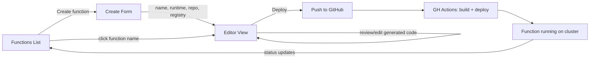

# FaaS PoC — Design Plan

**Updated:** 2026-03-18
**Status:** Design in progress — architecture, UI flow, project structure, service wiring approved. Service details pending.

---

## Executive Summary

A **Functions-as-a-Service PoC UI** for the OpenShift Web Console, built as a dynamic plugin. Developers create, edit, and deploy serverless functions without CLI knowledge. **GitHub is the control plane** — the UI generates all function artifacts and pushes them to a GitHub repo, where a GitHub Actions workflow handles build and deployment to the cluster.

Designed for **dual use**: OCP Console dynamic plugin + donatable upstream to Knative as a standalone reference UI.

---

## Architecture


---

## Decisions

| # | Decision | Status |
|---|----------|--------|
| 1 | **PoC scope** = Function List + Create + Editor | ✅ |
| 2 | **Tech stack** = React + PatternFly 6 + OCP Dynamic Plugin SDK | ✅ |
| 3 | **Reference** = CronTab plugin for architecture patterns | ✅ |
| 4 | **Source of truth** = GitHub repo with func.yaml + code | ✅ |
| 5 | **Deployment** = GitHub Workflow runs `func deploy` | ✅ |
| 6 | **Deployment type** = KEDA for PoC | ✅ |
| 7 | **Template** = HTTP only for PoC | ✅ |
| 8 | **3 service hooks** as stable API consumed by all views | ✅ |
| 9 | **FunctionService strategy** = spike WASM first, fallback to backend or TS | ✅ |
| 10 | **ClusterService** = OCP SDK hooks, upstream TBD | ✅ |
| 11 | **Create flow** = form → editor → deploy | ✅ |
| 12 | **Extension types** = `console.page/route` + `console.navigation/section` + `console.navigation/href` | ✅ |
| 13 | **Table component** = PatternFly Data view (not deprecated VirtualizedTable) | ✅ |
| 14 | **Project structure** = views/, components/, services/ | ✅ |
| 15 | **Service wiring** = hooks returning singletons or wrapping SDK hooks | ✅ |

---

## User Flow



1. User fills in **Create Form** — name, runtime, GitHub repo, registry, namespace
2. `useFunctionService` generates func.yaml, boilerplate code, GitHub Workflow YAML
3. User lands in **Editor** — can review/edit the generated code
4. User clicks **Deploy** — files pushed to GitHub via `useSourceControl`
5. GitHub Actions picks up the push, runs `func deploy`, deploys to cluster
6. User returns to **List** — function appears with live status from `useClusterService`

---

## Project Structure

```
func-console/
├── console-extensions.json       # declares nav items + page routes
├── package.json                  # plugin metadata, exposedModules, deps
├── webpack.config.ts             # webpack module federation config
├── Dockerfile                    # container image for deployment
│
├── src/
│   ├── services/                 # interfaces + implementations
│   │   ├── types.ts              # FunctionConfig, GeneratedFiles, etc.
│   │   ├── function/
│   │   │   ├── FunctionService.ts          # TypeScript interface
│   │   │   ├── useFunctionService.ts       # hook returning singleton
│   │   │   └── FunctionService.github.ts   # PoC implementation
│   │   ├── source-control/
│   │   │   ├── SourceControlService.ts     # TypeScript interface
│   │   │   ├── useSourceControl.ts         # hook returning singleton
│   │   │   └── SourceControlService.github.ts
│   │   └── cluster/
│   │       ├── ClusterService.ts           # TypeScript interface
│   │       └── useClusterService.ts        # hook wrapping OCP SDK hooks
│   │
│   ├── views/                    # exposed modules - $codeRef targets
│   │   ├── FunctionListPage.tsx
│   │   ├── FunctionCreatePage.tsx
│   │   └── FunctionEditorPage.tsx
│   │
│   ├── components/               # reusable UI pieces
│   │   ├── FunctionTable.tsx     # PatternFly Data view
│   │   ├── CreateForm.tsx        # form fields
│   │   └── EmptyState.tsx        # no functions state
│   │
│   └── utils/
│       └── constants.ts          # route paths, labels, defaults
│
├── locales/                      # i18n translations
└── charts/                       # Helm chart for OCP deployment
```

---

## Service Wiring

Three hooks, same consumer pattern, different internals:

```tsx
// FunctionService + SourceControlService: hook returns a singleton
const instance = new GitHubFunctionService();
export const useFunctionService = (): FunctionService => instance;

// ClusterService: hook wraps OCP SDK reactive hooks
export function useClusterService(): ClusterService {
  const [data, loaded, error] = useK8sWatchResource({...});
  return { functions: data, loaded, error };
}
```

Components always consume via hooks — never import implementations directly:

```tsx
const { functions, loaded } = useClusterService();
const svc = useFunctionService();
```

Swapping implementations = change what the hook returns. Zero component changes.

---

## Three Service Interfaces

### FunctionService

Generates function artifacts from form inputs.

- `generateFunction(config)` → files map (func.yaml, handler code, package files)
- `generateWorkflow(config)` → files map (.github/workflows/func-deploy.yaml)

### SourceControlService

Manages GitHub repos, file pushes, secrets.

- `createRepo()`, `pushFiles()`, `createSecret()`, `createVariable()`, `listFunctionRepos()`
- PoC: GitHub REST API with browser-based OAuth

### ClusterService

Queries deployed function status from K8s.

- `functions` — list of deployed functions with status
- `loaded` — boolean
- `error` — any error
- PoC: wraps OCP Console SDK `useK8sWatchResource`

---

## Console Extensions

```json
[
  {
    "type": "console.navigation/section",
    "properties": { "id": "functions-section", "name": "Functions", "perspective": "dev" }
  },
  {
    "type": "console.navigation/href",
    "properties": { "id": "functions-list", "name": "Functions", "href": "/functions", "section": "functions-section", "perspective": "dev" }
  },
  {
    "type": "console.page/route",
    "properties": { "path": "/functions", "component": { "$codeRef": "FunctionListPage" }, "exact": true }
  },
  {
    "type": "console.page/route",
    "properties": { "path": "/functions/create", "component": { "$codeRef": "FunctionCreatePage" }, "exact": true }
  },
  {
    "type": "console.page/route",
    "properties": { "path": "/functions/edit/:name", "component": { "$codeRef": "FunctionEditorPage" } }
  }
]
```

---

## WASM Feasibility Summary

| Component | WASM-friendly? | Notes |
|-----------|---------------|-------|
| Workflow YAML generation | ✅ Yes | stdlib + yaml.v3 only, ~210 lines |
| Code templates | ✅ Trivial | Static files, embeddable |
| func.yaml generation | ⚠️ Moderate | Needs refactor to remove OS/viper deps |
| Full client.Init | ⚠️ Moderate | Filesystem writes need abstraction |

**Plan:** Refactor func CLI (`cmd/ci/*` → `pkg/ci/github/*`, remove viper), then spike a WASM compilation test.

---

## What the UI Generates

| Artifact | Source | Content |
|----------|--------|---------|
| **func.yaml** | FunctionService | name, runtime, registry, namespace, builder, deploy type |
| **Handler code** | FunctionService | Runtime-specific boilerplate (~30 lines) |
| **package files** | FunctionService | package.json / go.mod / requirements.txt |
| **GH Workflow** | FunctionService | 6-step YAML: checkout → test → k8s-context → registry-login → install-func → deploy |
| **GH Secrets** | SourceControlService | KUBECONFIG, REGISTRY_PASSWORD |
| **GH Variables** | SourceControlService | REGISTRY_URL, REGISTRY_USERNAME, REGISTRY_LOGIN_URL |

---

## SDK Components We Use

### UI Components

| Component | Purpose |
|-----------|---------|
| `ListPageHeader` | Page header with title |
| `CodeEditor` | Monaco-based code editor (lazy loaded) |
| `ErrorStatus` / `ProgressStatus` / `SuccessStatus` | Status indicators |
| `ErrorBoundaryFallbackPage` | Catch unexpected errors |
| `useDeleteModal` | Delete confirmation modal |
| PatternFly Data view | Function list table |

### Data Hooks

| Hook | Purpose |
|------|---------|
| `useK8sWatchResource` | Watch deployed functions reactively |
| `useActiveNamespace` | Get/set active namespace |
| `consoleFetchJSON` | HTTP requests with Console headers |

---

## Next Steps

- [ ] Define service interfaces in detail (types, methods, error handling)
- [ ] Write full design spec
- [ ] Spike: WASM compilation of func CLI Go packages
- [ ] Begin implementation

---

## Key References

| Resource | Link |
|----------|------|
| OCPSTRAT-2460 | <https://redhat.atlassian.net/browse/OCPSTRAT-2460> |
| Plugin Template | <https://github.com/openshift/console-plugin-template> |
| CronTab Plugin | <https://github.com/openshift/console-crontab-plugin> |
| Dynamic Plugin SDK | <https://github.com/openshift/console/blob/main/frontend/packages/console-dynamic-plugin-sdk/README.md> |
| Dynamic Plugins Summary | [`resources/ocp-dynamic-plugins-summary.md`](resources/ocp-dynamic-plugins-summary.md) |
| Dynamic Plugin Guide | [`resources/ocp-console-dynamic-plugin-guide.md`](resources/ocp-console-dynamic-plugin-guide.md) |
| PatternFly | <https://patternfly.org> |
| func CLI CI code | `knative-func/cmd/ci/` |
| func templates | `knative-func/templates/{go,node,python}/` |
