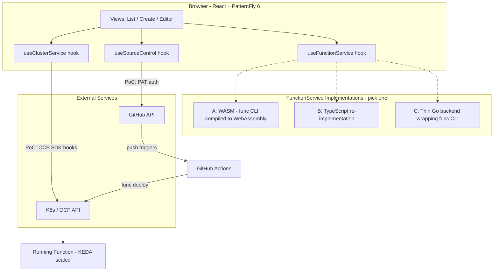
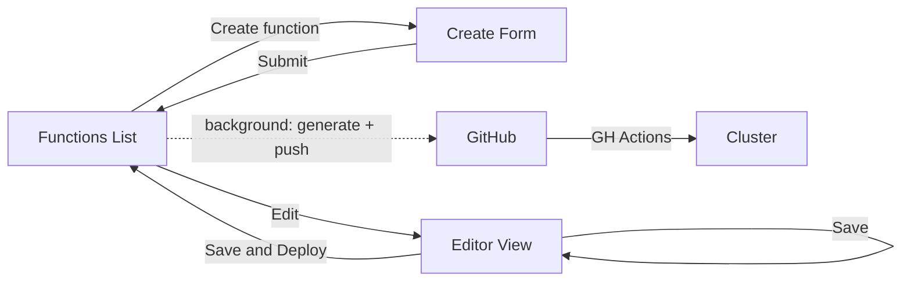

# FaaS PoC — Design Plan

**Updated:** 2026-03-25
**Status:** Design complete — ready for final review.

---

## Executive Summary

A **Functions-as-a-Service PoC UI** for the OpenShift Web Console, built as a dynamic plugin. Developers create, edit, and deploy serverless functions without CLI knowledge. **GitHub is the control plane** — the UI generates all function artifacts and pushes them to a GitHub repo, where a GitHub Actions workflow handles build and deployment to the cluster.

Designed for **dual use**: OCP Console dynamic plugin + donatable upstream to Knative as a standalone reference UI.

---

## Architecture



---

## Decisions

| # | Decision | Status |
|---|----------|--------|
| 1 | **PoC scope** = Function List + Create + Editor | ✅ |
| 2 | **Tech stack** = React + PatternFly 6 + OCP Dynamic Plugin SDK | ✅ |
| 3 | **Reference** = CronTab plugin for architecture patterns | ✅ |
| 4 | **Source of truth** = GitHub repo with func.yaml + code | ✅ |
| 5 | **Deployment** = GitHub Workflow runs `func deploy` | ✅ |
| 6 | **Deployment type** = KEDA for PoC | ✅ |
| 7 | **Template** = HTTP only for PoC | ✅ |
| 8 | **3 service hooks** as stable API consumed by all views | ✅ |
| 9 | **FunctionService strategy** = spike WASM first, fallback to backend or TS | ✅ |
| 10 | **ClusterService** = OCP SDK hooks, upstream TBD | ✅ |
| 11 | **Create flow** = form → list (background: generate + push + deploy) | ✅ |
| 12 | **Extension types** = `console.page/route` + `console.navigation/section` + `console.navigation/href` | ✅ |
| 13 | **Table component** = PatternFly Data view (not deprecated VirtualizedTable) | ✅ |
| 14 | **Project structure** = views/, components/, services/ | ✅ |
| 15 | **Service wiring** = hooks returning singletons or wrapping SDK hooks | ✅ |

---

## User Flow



### Create Flow

1. User fills in **Create Form** — name, runtime, repo, registry, namespace
2. User clicks **Create** → immediately redirects to **List**
3. **Background:** FunctionService generates files → SourceControlService creates repo, pushes files, sets secrets/variables
4. Function appears in list with progressive status: Creating repo → Pushing → Pushed to GitHub → Deploying → Running
5. Once **Running** → list shows function URL (clickable/copyable)
6. If any step fails → status shows error, `addError()` surfaces details

### Edit Flow

1. User clicks **Edit** on a function → Editor Page loads files from GitHub
2. User edits code in TreeView + CodeEditor
3. **Save** — commit/push to GitHub, stay in Editor
4. **Save & Deploy** — commit/push to GitHub, redirect to List which shows progressive status (CI starts) Testing → Building → Deploying → Running

---

## Project Structure

```txt
func-console/
├── console-extensions.json       # declares nav items + page routes
├── package.json                  # plugin metadata, exposedModules, deps
├── webpack.config.ts             # webpack module federation config
├── Dockerfile                    # container image for deployment
│
├── src/
│   ├── services/                 # interfaces + implementations
│   │   ├── types.ts              # FunctionConfig, GeneratedFiles, etc.
│   │   ├── function/
│   │   │   ├── FunctionService.ts          # TypeScript interface
│   │   │   ├── useFunctionService.ts       # hook returning singleton
│   │   │   └── FunctionService.github.ts   # PoC implementation
│   │   ├── source-control/
│   │   │   ├── SourceControlService.ts     # TypeScript interface
│   │   │   ├── useSourceControl.ts         # hook returning singleton
│   │   │   └── SourceControlService.github.ts
│   │   └── cluster/
│   │       ├── ClusterService.ts           # TypeScript interface
│   │       └── useClusterService.ts        # hook wrapping OCP SDK hooks
│   │
│   ├── views/                    # exposed modules - $codeRef targets
│   │   ├── FunctionListPage.tsx
│   │   ├── FunctionCreatePage.tsx
│   │   └── FunctionEditorPage.tsx
│   │
│   ├── components/               # reusable UI pieces
│   │   ├── FunctionTable.tsx     # PatternFly Data view
│   │   ├── CreateForm.tsx        # form fields
│   │   ├── EmptyState.tsx        # no functions state
│   │   └── ErrorProvider.tsx     # ErrorContext + AlertGroup wrapper
│   │
│   └── utils/
│       └── constants.ts          # route paths, labels, defaults
│
├── locales/                      # i18n translations
└── charts/                       # Helm chart for OCP deployment
```

---

## Error Handling

`ErrorProvider` component wraps each view. It provides `ErrorContext` with `addError(message)` available via `useErrorContext()` anywhere in the component tree. It renders a PatternFly `AlertGroup` at the top showing dismissable alerts. SDK `ErrorBoundaryFallbackPage` wraps each view for unexpected render crashes.

| Error type | How to report |
|---|---|
| Async errors (event handlers) | `try/catch` → `addError(err.message)` |
| Hook errors (returned error field) | `useEffect` inside hook → `addError()` with ref dedup |
| Render crashes | ErrorBoundary catches → fallback page |

---

## Service Interface Details

### Types

```typescript
type GeneratedFiles = Map<string, string>;  // filepath → content
```

### FunctionService

Generates function artifacts from form inputs. Pure data transformation, no I/O.

```typescript
interface FunctionConfig {
  name: string;                          // "my-function"
  runtime: 'node' | 'python' | 'go';
  registry: string;                      // "quay.io/sjakusch"
  namespace: string;                     // K8s namespace to deploy into
  repoName: string;                      // GitHub repo name
}

interface WorkflowConfig {
  branch: string;                        // default: "main"
}

interface FunctionService {
  generateFunction(config: FunctionConfig): GeneratedFiles;
  generateWorkflow(config: FunctionConfig, workflow: WorkflowConfig): GeneratedFiles;
}
```

- `generateFunction` → func.yaml, handler code, package files, .gitignore, tests
- `generateWorkflow` → .github/workflows/func-deploy.yaml
- Output consumed by TreeView+CodeEditor (display) and Octokit (push)

#### Error Handling

Pure synchronous — throws on invalid config at runtime.

### SourceControlService

Manages GitHub repos, file pushes, secrets.

**Implementation:** `@octokit/rest` + `@octokit/auth-token`
**Auth:** PoC uses GitHub PAT (user-provided token input). PAT stored in sessionStorage. OAuth to be explored during implementation.
**Discovery:** Repos tagged with `serverless-function` topic.

```typescript
interface RepoInfo {
  owner: string;
  name: string;
  url: string;
  defaultBranch: string;
}

interface SourceControlService {
  authenticate(): Promise<void>;
  isAuthenticated(): boolean;
  createRepo(name: string): Promise<RepoInfo>;
  listFunctionRepos(): Promise<RepoInfo[]>;
  push(repo: RepoInfo, files: GeneratedFiles, message: string): Promise<void>;
  fetch(repo: RepoInfo): Promise<GeneratedFiles>;
  createSecret(repo: RepoInfo, name: string, value: string): Promise<void>;
  createVariable(repo: RepoInfo, name: string, value: string): Promise<void>;
}
```

**Octokit mapping:**

- `createRepo` → `repos.createForAuthenticatedUser` + `repos.replaceAllTopics`
- `listFunctionRepos` → `search.repos({ q: 'topic:serverless-function user:...' })`
- `push` → `git.createBlob` → `git.createTree` → `git.createCommit` → `git.updateRef`
- `fetch` → `git.getTree({ recursive: '1' })` + blob content fetches
- `createSecret` → `actions.createOrUpdateRepoSecret` (requires libsodium encryption)
- `createVariable` → `actions.createRepoVariable`

**Implementation notes:**

- `createSecret` requires encrypting the value with the repo's public key using `tweetnacl` or `libsodium.js`
- `fetch` retrieves the full repo tree and all file contents for display in the editor

#### Error Handling

All methods reject with Octokit errors. Callers use try/catch → `addError()`. Invalid/expired PAT (401) → clear sessionStorage, prompt re-entry.

### ClusterService

Queries deployed function status from K8s. Consumed as a React hook.

**Implementation:** Hook wrapping OCP Console SDK `useK8sWatchResource`.
**Watches:** `Deployment` resources with label `function.knative.dev/name` (presence selector).
**Runtime:** from label `function.knative.dev/runtime`.
**Replicas:** from `deployment.status.readyReplicas`.
**Namespace:** from OCP SDK `useActiveNamespace()`.

```typescript
interface DeployedFunction {
  name: string;
  namespace: string;
  runtime: string;
  status: 'CreatingRepo' | 'Pushing' | 'PushedToGitHub' | 'Deploying' | 'Running' | 'ScaledToZero' | 'Error' | 'Unknown';
  url?: string;
  lastDeployed?: string;
  replicas: number;
}

interface ClusterService {
  functions: DeployedFunction[];
  loaded: boolean;
  error: unknown;
  deleteFunction(name: string, namespace: string): Promise<void>;
}
```

**Status derivation from Deployment:**

- `readyReplicas === desiredReplicas` → Running
- `readyReplicas === 0 && desiredReplicas === 0` → ScaledToZero
- `readyReplicas < desiredReplicas` → Deploying
- Conditions contain failure → Error
- Otherwise → Unknown

**Labels set by func CLI** (verified from `pkg/deployer/common.go`):

- `boson.dev/function: "true"` — legacy marker
- `function.knative.dev/name: <name>` — function name
- `function.knative.dev/runtime: <runtime>` — runtime (node, python, go)

#### Error Handling

Hook errors reported internally via `useEffect` → `addError()` with ref dedup. `deleteFunction` rejection handled by caller via try/catch → `addError()`.

**SDK hooks used:**

| Hook | Purpose |
|------|---------|
| `useK8sWatchResource` | Watch deployed functions reactively |
| `useActiveNamespace` | Get/set active namespace |
| `consoleFetchJSON` | HTTP requests with Console headers (used in `deleteFunction`) |

## Service Wiring

Three hooks, same consumer pattern, different internals:

```tsx
// FunctionService + SourceControlService: hook returns a singleton
const instance = new GitHubFunctionService();
export const useFunctionService = (): FunctionService => instance;

// ClusterService: hook wraps OCP SDK reactive hooks
export function useClusterService(): ClusterService {
  const [data, loaded, error] = useK8sWatchResource({...});
  return { functions: data, loaded, error };
}
```

Components always consume via hooks — never import implementations directly:

```tsx
const { functions, loaded } = useClusterService();
const svc = useFunctionService();
```

Swapping implementations = change what the hook returns. Zero component changes.

---

## Views

Implementation details and decisions about the three views we will implement.

### Routing

| Route | View | Navigation trigger |
|---|---|---|
| `/functions` | List Page | Nav click or plugin load |
| `/functions/create` | Create Page | List → "Create function" button |
| `/functions/edit/:name` | Editor Page | List → click function name or kebab "Edit" |

**Editor Page data loading:**

- RepoInfo available in list row context, passed via navigation state → `sourceControl.fetch(repo)` loads files

### Functions List Page

The function list merges data from **both** GitHub and the cluster:

- **SourceControlService.listFunctionRepos()** — provides all function repos (source of truth)
- **ClusterService** — provides deployment status for functions that are deployed

A function may exist in GitHub but not yet be deployed (status: "Not deployed"). The list correlates by function name (from func.yaml ↔ Deployment label).

#### Delete Flow

Mirrors func CLI behavior (undeploy only, source code unaffected).

**What happens:** Deletes the Deployment by name in namespace. Owner references cascade: K8s Service and KEDA ScaledObject are removed automatically by the API server.

**UI flow:**

1. User clicks kebab → "Delete" on a function row
2. Confirmation modal: "Undeploy function \<name\>? This removes the function from the cluster. The source code in GitHub is not affected."
3. On confirm: `clusterService.deleteFunction(name, namespace)`
4. List refreshes automatically via `useK8sWatchResource` reactivity

#### Error Handling

GitHub API errors and cluster errors surface via `addError()` in AlertGroup. View remains visible.

**SDK components used:**

| Component | Purpose |
|-----------|---------|
| `ListPageHeader` | Page header with title |
| `ErrorStatus` / `ProgressStatus` / `SuccessStatus` | Status indicators in table rows |
| `ErrorBoundaryFallbackPage` | Catch unexpected errors |
| `useDeleteModal` | Delete confirmation modal |
| PatternFly Data view | Function list table |

### Functions Create Page

Form-only page. On submit, redirects to List and triggers background processing.

**What gets generated and pushed (in background):**

| Artifact | Source | Content |
|----------|--------|---------|
| **func.yaml** | FunctionService | name, runtime, registry, namespace, builder, deploy type |
| **Handler code** | FunctionService | Runtime-specific boilerplate (~30 lines) |
| **package files** | FunctionService | package.json / go.mod / requirements.txt |
| **GH Workflow** | FunctionService | 6-step YAML: checkout → test → k8s-context → registry-login → install-func → deploy |
| **GH Secrets** | SourceControlService | KUBECONFIG, REGISTRY_PASSWORD |
| **GH Variables** | SourceControlService | REGISTRY_URL, REGISTRY_USERNAME, REGISTRY_LOGIN_URL |

#### Error Handling

Form validation errors shown inline. Background errors (repo creation, push) surface via `addError()` on the List page.

### Functions Edit Page

PatternFly TreeView sidebar + SDK CodeEditor. Tree built from `GeneratedFiles` map keys split on `/`. Shows full repo contents.

**Actions:**

- **Save** — commit/push to GitHub, stay in Editor
- **Save & Deploy** — commit/push to GitHub, redirect to List, CI triggers, status updates shown

**SDK components used:**

| Component | Purpose |
|-----------|---------|
| `CodeEditor` | Monaco-based code editor (lazy loaded) |
| PatternFly TreeView | File tree sidebar built from `GeneratedFiles` map keys |
| `ErrorBoundaryFallbackPage` | Catch unexpected errors |

#### Error Handling

Fetch and push failures surface via `addError()`. View remains visible with last known content.

---

## Console Extensions

```json
[
  {
    "type": "console.navigation/section",
    "properties": { "id": "functions-section", "name": "Functions", "perspective": "dev" }
  },
  {
    "type": "console.navigation/href",
    "properties": { "id": "functions-list", "name": "Functions", "href": "/functions", "section": "functions-section", "perspective": "dev" }
  },
  {
    "type": "console.page/route",
    "properties": { "path": "/functions", "component": { "$codeRef": "FunctionListPage" }, "exact": true }
  },
  {
    "type": "console.page/route",
    "properties": { "path": "/functions/create", "component": { "$codeRef": "FunctionCreatePage" }, "exact": true }
  },
  {
    "type": "console.page/route",
    "properties": { "path": "/functions/edit/:name", "component": { "$codeRef": "FunctionEditorPage" } }
  }
]
```

---

## WASM — Decided

TinyGo compilation of func CLI packages confirmed viable by spike. Output ~500kB, shippable with the browser plugin. WASM module will be called from the Create flow to generate function artifacts (func.yaml, handler code, etc.).

Integration is part of the Create view implementation — tracked in `docs/features.json`.

---

## Next Steps

- [x] Design delete flow — undeploy only, mirrors func CLI
- [x] Design error handling — ErrorProvider + addError pattern
- [x] Clarify editor routing — by function name, RepoInfo passed via navigation state
- [x] Create AGENTS.md and CLAUDE.md — done during harness setup
- [x] Define testing strategy — see `docs/TESTING.md`
- [x] Populate features.json with initial PoC feature list
- [x] Create project setup — tracked in `docs/features.json`
- [x] Spike: WASM compilation — done (TinyGo, ~500kB, viable for browser-side function generation)

---

## Key References

| Resource | Link |
|----------|------|
| OCPSTRAT-2460 | <https://redhat.atlassian.net/browse/OCPSTRAT-2460> |
| SRVOCF-810 | <https://redhat.atlassian.net/browse/SRVOCF-810> |
| Plugin Template | <https://github.com/openshift/console-plugin-template> |
| CronTab Plugin | <https://github.com/openshift/console-crontab-plugin> |
| Dynamic Plugin SDK | <https://github.com/openshift/console/blob/main/frontend/packages/console-dynamic-plugin-sdk/README.md> |
| Dynamic Plugins Summary | [`resources/ocp-dynamic-plugins-summary.md`](resources/ocp-dynamic-plugins-summary.md) |
| Dynamic Plugin Guide | [`resources/ocp-console-dynamic-plugin-guide.md`](resources/ocp-console-dynamic-plugin-guide.md) |
| PatternFly | <https://patternfly.org> |
| func CLI CI code | `knative-func/cmd/ci/` |
| func templates | `knative-func/templates/{go,node,python}/` |
