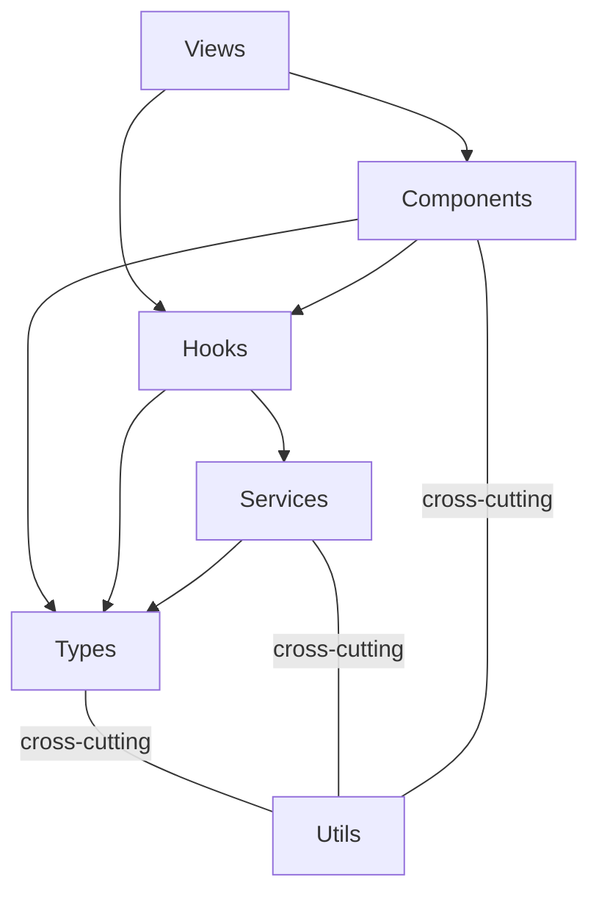

# Harness Engineering Setup — Design

**Date:** 2026-03-25
**Status:** Design approved, pending implementation

---

## Overview

A harness engineering setup for the func-console greenfield project. The harness is the complete designed environment inside which Claude/Roo agents operate — tools, guardrails, documentation, feedback loops, and scaffolding for clean handoffs between sessions.

Based on: Anthropic's two-agent architecture, OpenAI's Codex harness patterns, and the SWE-agent ACI research.

---

## Repository Knowledge Structure

`AGENTS.md` at repo root (~100 lines) is the table of contents — it points to everything, contains nothing deep. `docs/` is the single source of truth.

```txt
AGENTS.md                          # ~100 lines, map only
docs/
├── ARCHITECTURE.md                # layered architecture, dependency rules
├── design/                        # design specs - "what to build"
│   ├── 2026-03-16-faas-poc-design.md
│   └── 2026-03-25-harness-engineering-design.md
├── plans/                         # per-feature implementation plans
│   ├── active/                    # plans currently being worked on
│   └── completed/                 # finished plans moved here
├── references/                    # LLM-friendly reference material
│   ├── agent-struggles-readme.md
│   ├── ocp-console-dynamic-plugin-guide.md
│   └── ocp-dynamic-plugins-summary.md
├── features.json                  # inviolable feature list - ground truth
├── claude-progress.txt            # append-only session handoff log
└── agent-struggles.json           # struggle log for user review
```

### Config Updates Needed

- Roo mode-specific instructions: change plan directory from `.claude/plans/` to `docs/plans/`
- Claude Code `plansDirectory` setting if applicable
- Move existing `.claude/plans/` content to `docs/`
- `.claude/` directory: keep for Claude Code local config (settings, project memory), no longer used for plans or design docs

---

## Feature List (`docs/features.json`)

JSON array of features. Inviolable — features cannot be removed or edited, only `passes` flipped. Array order = priority (first `"passes": false` entry wins).

```json
[
  {
    "category": "technical",
    "description": "Dev environment starts with ./init.sh and serves the plugin in standalone mode",
    "steps": [
      "Run ./init.sh",
      "Verify dev server starts without errors",
      "Navigate to localhost and see the plugin UI"
    ],
    "passes": false
  }
]
```

### AGENTS.md Instruction

> features.json is inviolable. You may only change the `passes` field to `true` — and only after the corresponding e2e test passes AND you have validated the feature in a real browser via browser automation. Never remove, reorder, or edit feature entries. Work on the first entry where `passes` is `false`.

Features will be populated together (human + agent) after harness setup. Expected scope: 25-50 features for the PoC, covering both functional and technical items (CI setup, dev environment, linter config, browser automation are all features).

---

## Session Handoff Log (`docs/claude-progress.txt`)

Append-only, newest-first, committed to git. Fixed sections per entry.

```txt
# Claude Progress Log
# Newest entries first. Agents: append your entry at the top after the header.

---
## 2026-03-25 | Session: Harness setup scaffolding
Worked on: Created docs/ directory structure, AGENTS.md, features.json skeleton
Completed:
- docs/ directory with design/, plans/, references/ subdirectories
- AGENTS.md pointing to all docs
- Empty features.json with schema
Left off: Need to populate features.json with PoC feature list.
Blockers: None
```

---

## Agent Struggle Log (`docs/agent-struggles.json`)

JSON array. Agent appends entries when it encounters ambiguity or repeated failures. During startup, agent presents unresolved entries to the user before starting feature work. Only the user flips `resolved` to `true`. Initial file is empty (`[]`).

An explanation of this file and its purpose is documented in `docs/references/agent-struggles-readme.md` and referenced from `AGENTS.md`. The `agent-struggles-readme.md` explains the format, when to append entries, and that only the user may resolve them.

```json
[
  {
    "date": "2026-03-25",
    "description": "Could not determine which PatternFly component to use for status indicators",
    "cause": "missing docs",
    "suggestion": "Add PatternFly component mapping reference to docs/references/",
    "resolved": false
  }
]
```

---

## `init.sh` Script

The init.sh script reliably starts the dev environment. Its exact content will be determined during project setup (based on the dynamic plugin template). It will be a `features.json` entry. General expectations:

- Prerequisites check (Node.js 18+, npm)
- Install dependencies (`npm install`)
- Start dev server in standalone mode with mocked APIs

Later iteration: full OCP cluster mode (Cluster Bot ephemeral clusters for 8h testing windows).

---

## Coding Agent Behavioral Protocol

Documented in `AGENTS.md`. Will be extended with project-level overrides of global `~/.claude/CLAUDE.md` settings and adapted slash commands.

### Session Rules

- One feature at a time
- Clean state at end (code suitable for merging to main)
- Update `docs/claude-progress.txt` before session ends
- Commit work to git with descriptive message before ending

### Startup Sequence (every session)

1. `pwd` — confirm working directory
2. Read `docs/claude-progress.txt` + `git log --oneline -10` — orient
3. Read `docs/agent-struggles.json` — present unresolved entries to user
4. Read `docs/features.json` — pick first `"passes": false` entry
5. Run `./init.sh` — start dev env
6. Run tests — verify app is healthy
7. If broken → fix first. If clean → start next feature.

### Continuous Improvement

When the agent struggles, treat it as a signal: identify what is missing (tools, guardrails, documentation) and log it to `docs/agent-struggles.json` rather than silently working around the issue.

---

## Layered Architecture (`docs/ARCHITECTURE.md`)



Arrows mean "imports / depends on."

| Layer | Maps to | Depends on |
|-------|---------|------------|
| **Types** | `services/types.ts` | nothing |
| **Services** | `services/*/Service.ts` + implementations | Types, Utils |
| **Hooks** | `services/*/use*.ts` — wiring layer | Services, Types, Utils |
| **Components** | `components/` — FunctionTable, CreateForm, etc. | Hooks, Types, Utils |
| **Views** | `views/` — page-level components | Components, Hooks, Utils |
| **Utils** | `utils/` — constants, helpers | nothing (cross-cutting) |

### Enforced Rules

- Unidirectional: Types <- Services <- Hooks <- Components <- Views
- Utils can be imported by any layer
- Views never import Services directly (always through Hooks)
- Services never import Components or Views
- No circular dependencies

### Architectural Guidance (in ARCHITECTURE.md)

- PatternFly components preferred over custom HTML
- Error handling through ErrorProvider/addError pattern
- Shared utilities in `utils/`, not hand-rolled per component

---

## Linter and Taste Invariants

Setup as a `features.json` entry (technical category). Once implemented:

**Structural (eslint-plugin-boundaries or eslint-plugin-import):**

- Layer dependency rules (unidirectional enforcement)
- No circular dependencies

**Code quality:**

- No `any` type (`@typescript-eslint/no-explicit-any`)
- No `console.log`
- Explicit return types on service methods and hooks
- Naming conventions: `use*` prefix for hooks, `*Service` suffix for services, PascalCase for components/types

**Agent-friendly error messages:**

- Linter errors include remediation instructions so agents can self-correct

**Enforcement:** CI pipeline runs all linters on every PR.

---

## Browser Automation

Setup as a `features.json` entry (technical category). Once implemented:

- Puppeteer or Playwright MCP server configured in project (`.mcp.json` or Roo MCP settings)
- Agent launches standalone dev server, navigates to the UI, follows feature steps
- Required before flipping `passes` to `true` in features.json
- Catches UI bugs invisible from code alone

---

## Git Worktree Isolation

- Superpowers `using-git-worktrees` skill already available
- Each feature gets its own worktree branch
- Changes validated in isolation before merge
- Supports future parallel agent work via Roo orchestrator mode or superpowers subagent-driven-development

---

## Decisions

| # | Decision | Status |
|---|----------|--------|
| 1 | `docs/` replaces `.claude/plans/` as canonical location | ✅ |
| 2 | `AGENTS.md` at root as table of contents (~100 lines) | ✅ |
| 3 | `features.json` format: category, description, steps, passes | ✅ |
| 4 | Feature priority: array order (first passes:false wins) | ✅ |
| 5 | `claude-progress.txt` format: newest-first, fixed sections | ✅ |
| 6 | `agent-struggles.json` format: date, description, cause, suggestion, resolved | ✅ |
| 7 | Layered architecture: Views → Components → Hooks → Services → Types (dependency direction) | ✅ |
| 8 | No golden-principles.md — dissolved into linter rules + ARCHITECTURE.md | ✅ |
| 9 | No file size limit enforcement | ✅ |
| 10 | init.sh, linter setup, browser automation = features.json entries | ✅ |
| 11 | Plans directory: docs/plans/active/ + docs/plans/completed/ | ✅ |
| 12 | Agent protocol: project-level overrides of global settings + adapted slash commands | ✅ |

---

## Implementation Order

1. Create `docs/` directory structure (move `.claude/plans/` content)
2. Create `AGENTS.md` at repo root
3. Create `docs/ARCHITECTURE.md`
4. Create `docs/features.json` (empty, populate together)
5. Create `docs/claude-progress.txt` (initial entry)
6. Create `docs/agent-struggles.json` (empty `[]` + explanation)
7. Update Roo mode-specific instructions (plan directory)
8. Adapt slash commands for project-level use
9. Initial git commit of harness setup
